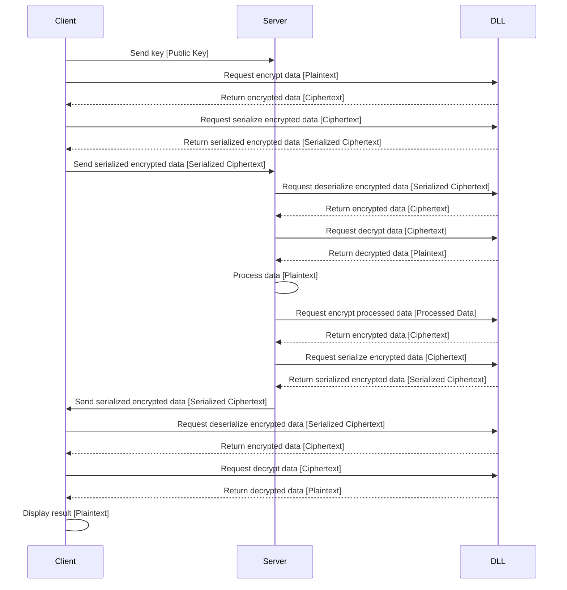

# 개요
해당 프로젝트는 아래와 같은 동작을 수행합니다.

- C++를 사용해서 암호화에 사용되는 DLL 파일을 컴파일합니다.
- Java, C#를 각각 서버와 클라이언트로 구현하여 같은 DLL 파일을 Linking하여 암호화 및 복호화에 사용합니다.

암호화에는 OpenSSL을 사용하였으며, 암호화에는 AES-256-cbc 방식을 사용하였습니다.
# 시연


# FlowChart

# 부가설명
FlowChart에서 사용된 Serialize의 의미는 암호화를 위해서 필요한 데이터를 정의한 아래와 같은 구조체를 byte 배열의 구조로 변환하는 과정을 의미하며, deSerialize는 반대로 구조체로 변환하는 것을 의미합니다.
```C++
struct EncryptedData {
    unsigned char* ciphertext;
    int ciphertext_len;
    unsigned char* iv;
};
```
# 실행방법
DLL 파일은 실행파일 내부적으로 첨부되어 있으므로, Server를 Java로 실행하고, Client를 C#으로 디버그 모드로 실행합니다.
